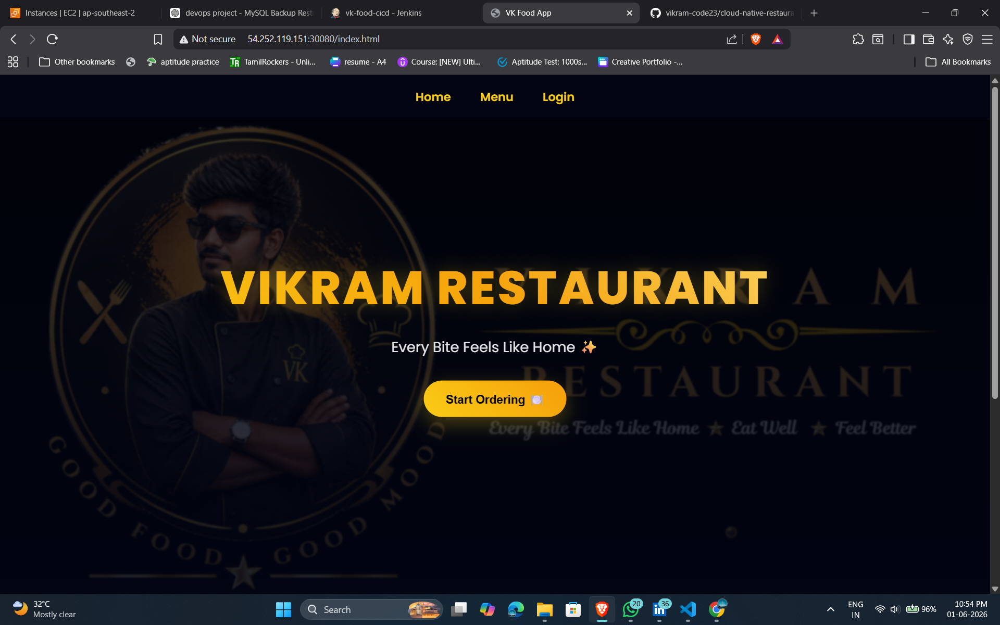
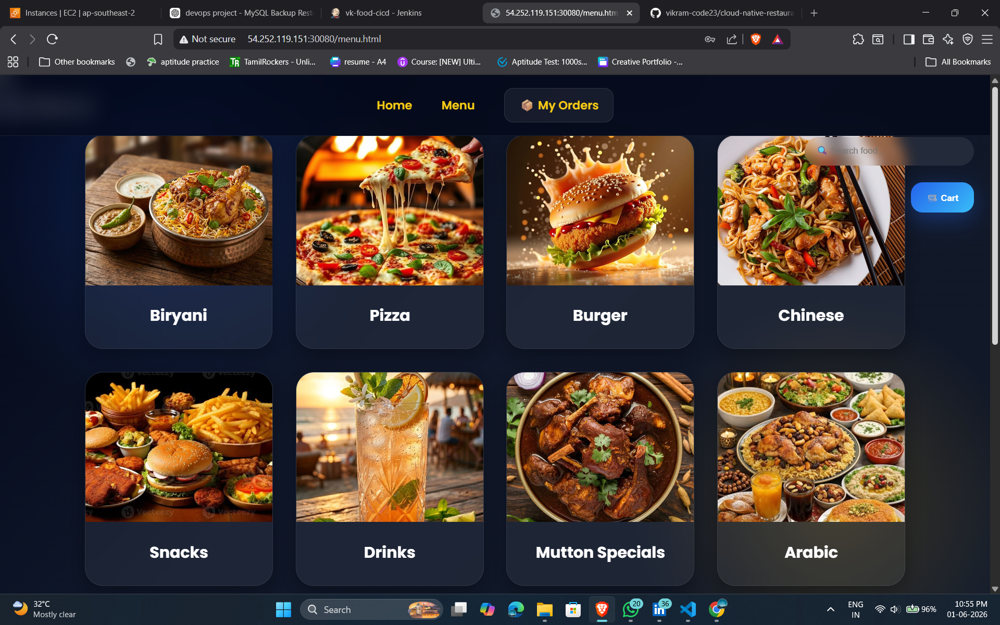
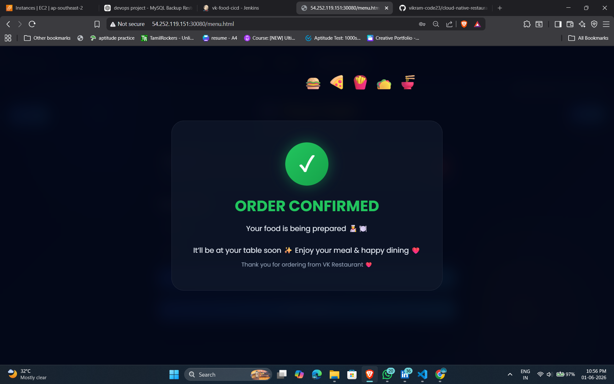
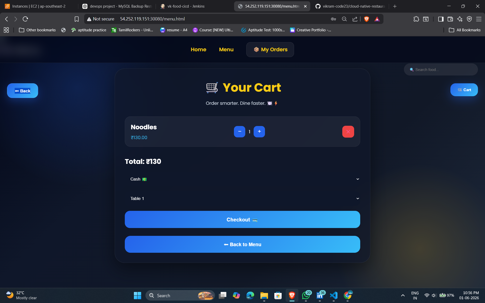
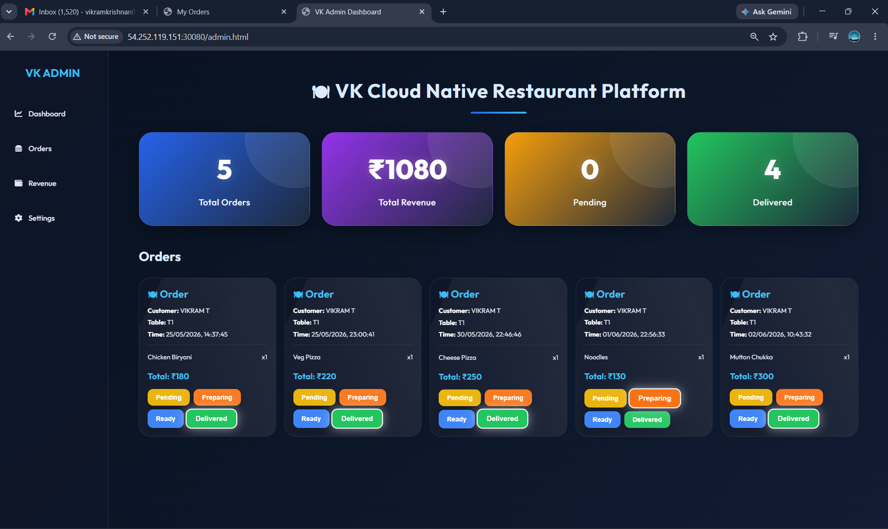
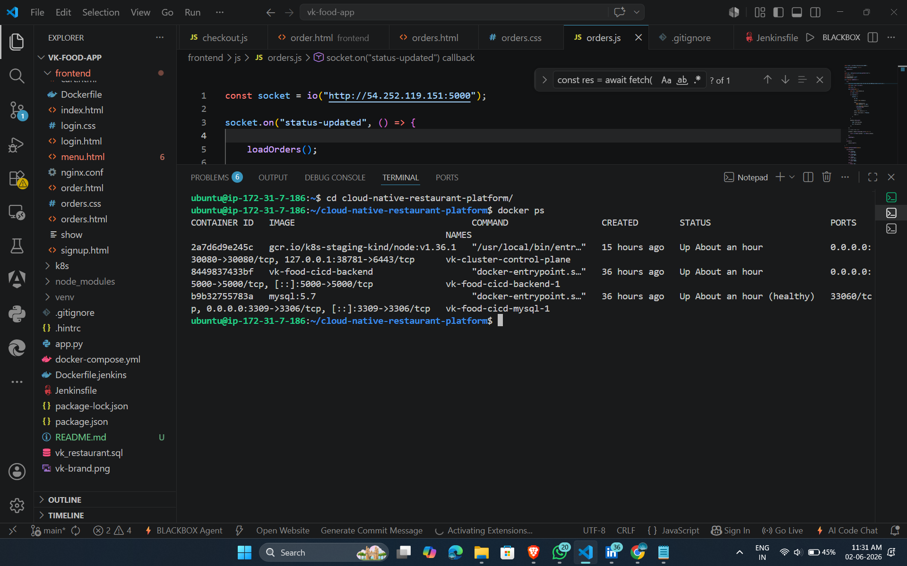
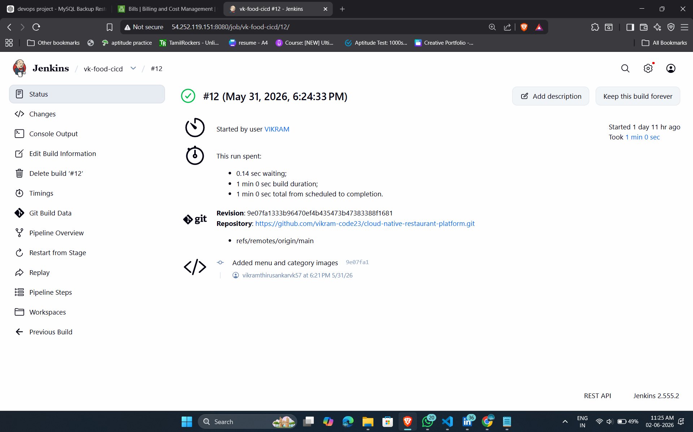
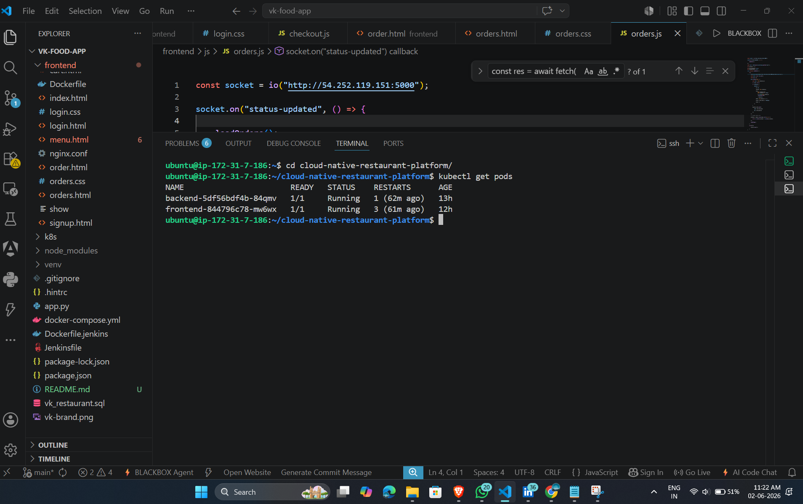
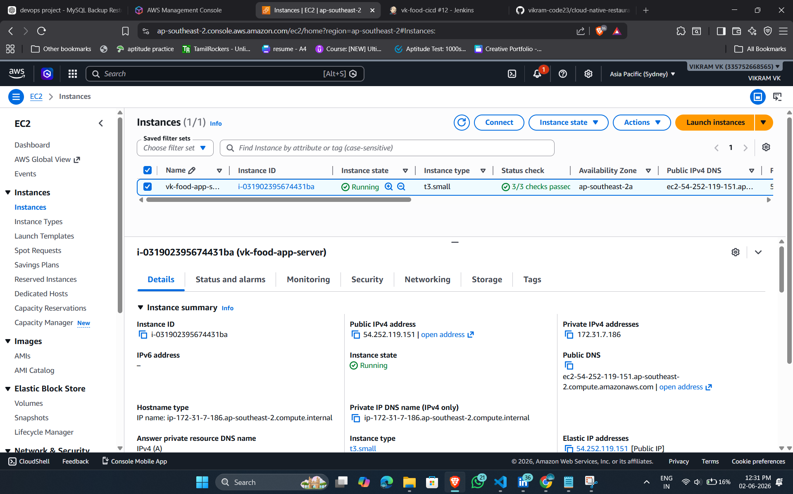

# Cloud Native Restaurant Platform

## Executive Summary

The Cloud Native Restaurant Platform is a full-stack food ordering application designed and deployed using modern cloud-native and DevOps practices.

The project enables customers to browse food categories, place orders, track order status in real time, and interact with a responsive user interface. Administrators can manage incoming orders through a dedicated dashboard with live order updates powered by Socket.IO.

The application was containerized using Docker, automated using Jenkins CI/CD pipelines, orchestrated using Kubernetes, and hosted on AWS EC2.

This project demonstrates practical implementation of modern DevOps methodologies including containerization, continuous integration, continuous deployment, infrastructure management, service orchestration, troubleshooting, and production-style application deployment.

---

# Solution Architecture

## High Level Architecture

```text
Customer Browser
        │
        ▼
   Frontend (Nginx)
        │
        ▼
 Backend API (Node.js + Express)
        │
        ▼
     MySQL Database
        │
        ▼
 Real-Time Updates
    (Socket.IO)

Deployment Platform

GitHub
   │
   ▼
 Jenkins CI/CD
   │
   ▼
 Docker Images
   │
   ▼
 Kubernetes Cluster (Kind)
   │
   ▼
 AWS EC2
```

## Architecture Explanation

The application follows a three-tier architecture.

### Presentation Layer

The frontend is built using HTML, CSS, and JavaScript.

Responsibilities:

* User authentication
* Food browsing
* Cart management
* Order placement
* Order tracking
* Admin dashboard

Nginx serves all frontend static files.

---

### Application Layer

The backend is developed using Node.js and Express.js.

Responsibilities:

* REST API handling
* Business logic processing
* Database communication
* Order management
* Real-time communication using Socket.IO

The backend acts as the bridge between frontend and database.

---

### Data Layer

MySQL stores all application data.

Tables include:

* Users
* Foods
* Orders
* Checkout Details

The database acts as the persistent storage layer for the platform.

---

# Application Workflow

## Customer Workflow

1. User Registration
2. User Login
3. Browse Food Categories
4. Select Food Items
5. Add Items to Cart
6. Select Table Number
7. Checkout Order
8. Track Order Status
9. Receive Live Updates

---

## Admin Workflow

1. Open Admin Dashboard
2. View Incoming Orders
3. Update Order Status
4. Monitor Revenue
5. Manage Order Lifecycle

---

# Database Design

## Users Table

Stores:

* User ID
* Username
* Email
* Password

Purpose:

Used for authentication and order ownership.

---

## Foods Table

Stores:

* Food ID
* Food Name
* Category
* Price
* Image

Purpose:

Maintains restaurant menu data.

---

## Orders Table

Stores:

* Order Details
* Quantity
* Status
* Checkout Information

Purpose:

Tracks all customer orders.

---

# Docker Implementation

## Why Docker Was Used

Docker was implemented to solve environment consistency issues.

Without Docker:

* Different machine configurations
* Dependency conflicts
* Deployment inconsistencies

With Docker:

* Same environment everywhere
* Portable deployment
* Faster setup
* Easy scaling

---

## Frontend Container

Dockerfile:

Purpose:

* Use Nginx base image
* Copy frontend files
* Serve static content

Build Command:

```bash
docker build -t vk-food-cicd-frontend .
```

Explanation:

* docker build = Create image
* -t = Assign image tag
* vk-food-cicd-frontend = Image name
* . = Current directory build context

---

## Backend Container

Dockerfile:

Purpose:

* Install Node.js dependencies
* Copy source code
* Start backend service

Build Command:

```bash
docker build -t vk-food-cicd-backend .
```

---

## Docker Compose

Purpose:

Manage multiple containers together.

Services:

* Frontend
* Backend
* MySQL

Startup Command:

```bash
docker-compose up -d
```

Explanation:

* up = Start services
* -d = Detached mode

Verification:

```bash
docker ps
```

Purpose:

Displays running containers.
 
--- 
# Jenkins CI/CD Pipeline

## Objective

Automate application deployment whenever code is pushed to GitHub.

---

## Jenkins Workflow

Developer Pushes Code
        │
        ▼
      GitHub
        │
        ▼
     Jenkins
        │
        ▼
 Create .env File
        │
        ▼
 Docker Compose Down
        │
        ▼
 Docker Compose Up --Build
        │
        ▼
 Updated Application

---

## Jenkinsfile Stages

### Stage 1: Clone Repository

Purpose:

Downloads latest source code from GitHub.

Command:

```groovy
git branch: 'main',
url: 'https://github.com/vikram-code23/cloud-native-restaurant-platform.git'
```

## Project Structure
```text
cloud-native-restaurant-platform
│
├── frontend/
│   ├── admin.html
│   ├── orders.html
│   ├── menu.html
│   ├── login.html
│   ├── signup.html
│   ├── admin.js
│   ├── images/
│   └── Dockerfile
│
├── backend/
│   ├── server.js
│   ├── db.js
│   ├── package.json
│   └── Dockerfile
│
├── k8s/
│   ├── frontend-deployment.yaml
│   ├── frontend-service.yaml
│   ├── backend-deployment.yaml
│   ├── backend-service.yaml
│   ├── mysql-deployment.yaml
│   └── mysql-service.yaml
│
├── Jenkinsfile
├── docker-compose.yml
├── vk_restaurant.sql
└── README.md
```
---

# Kubernetes Implementation

## Why Kubernetes Was Used

Although Docker solved containerization challenges, managing containers manually becomes difficult as applications grow.

Kubernetes was introduced to provide:

* Automated container management
* Self-healing capabilities
* Service discovery
* Scalability
* High availability

Benefits achieved:

* Automatic pod restart
* Service abstraction
* Simplified deployments
* Better infrastructure management

---

## Kubernetes Components Used

### Deployments

Deployments were created for:

* Frontend
* Backend
* MySQL

Purpose:

* Manage application pods
* Maintain desired state
* Enable rolling updates

---

### Services

Services were created for:

* Frontend Service
* Backend Service
* MySQL Service

Purpose:

* Enable communication between components
* Expose applications inside the cluster

---

## Kubernetes Deployment Commands

Create resources:

```bash
kubectl apply -f k8s/
```

Verify deployments:

```bash
kubectl get deployments
```

Verify pods:

```bash
kubectl get pods
```

Verify services:

```bash
kubectl get svc
```

Purpose:

These commands help verify whether all Kubernetes resources are running successfully.

---

# AWS EC2 Infrastructure

## Why AWS EC2 Was Used

AWS EC2 was selected as the infrastructure platform because it provides:

* Virtual server hosting
* Scalability
* Cost-effective deployment
* Industry-standard cloud environment

---

## EC2 Configuration

Operating System:

```text
Ubuntu Server
```

Infrastructure Hosted:

* Jenkins
* Docker
* Docker Compose
* Kubernetes (Kind)
* Restaurant Application

---

## Security Configuration

Security Group Rules:

| Port | Purpose |
|--------|----------|
| 22 | SSH Access |
| 80 | Frontend Application |
| 8080 | Jenkins Dashboard |
| 5000 | Backend API |
| 30000+ | Kubernetes NodePort Services |

---

# Real-Time Communication Using Socket.IO

## Objective

Provide live order updates between customer and administrator.

---

## Workflow

Customer Places Order
        │
        ▼
Backend Receives Order
        │
        ▼
Socket Event Triggered
        │
        ▼
Admin Dashboard Updates
        │
        ▼
Admin Changes Status
        │
        ▼
Customer Receives Live Update

---

## Benefits

* Instant order updates
* Improved customer experience
* Reduced page refresh dependency
* Real-time synchronization

---

# CI/CD Pipeline Flow

## Complete Pipeline

```text
Developer
    │
    ▼
GitHub Push
    │
    ▼
Jenkins Pipeline
    │
    ▼
Clone Repository
    │
    ▼
Generate .env File
    │
    ▼
Docker Compose Down
    │
    ▼
Docker Compose Build
    │
    ▼
Docker Compose Up
    │
    ▼
Updated Application
```

---

## Pipeline Benefits

* Automated deployment
* Reduced manual effort
* Faster delivery
* Consistent environments
* Improved reliability

---

# Challenges Faced and Troubleshooting

During the implementation of the Cloud Native Restaurant Platform, several technical challenges were encountered. Each issue was analyzed, debugged, and resolved through systematic troubleshooting.

---

## Issue 1: MySQL Container Startup Failure

### Problem

Backend application failed to connect with MySQL.

Error:

```text
ECONNREFUSED
MySQL Connection Failed
```

### Root Cause

Backend service started before MySQL was fully initialized.

### Solution

Implemented Docker Compose Health Checks and Depends-On Conditions.

Configuration:

```yaml
depends_on:
  mysql:
    condition: service_healthy
```

### Result

Backend started only after MySQL became healthy.

---

## Issue 2: Kubernetes Image Update Problem

### Problem

Application changes were not reflected after deployment updates.

### Root Cause

Kind cluster was using cached Docker images.

### Solution

Reloaded updated images manually.

Command:

```bash
kind load docker-image vk-food-cicd-frontend:latest --name vk-cluster
```

Restarted deployment:

```bash
kubectl rollout restart deployment/frontend
```

### Result

Latest application changes became visible immediately.

---

## Issue 3: Food Images Not Loading

### Problem

Menu images were not displayed after deployment.

### Root Cause

Filename mismatch between source code and deployed files.

Example:

```text
burgers.jpg
burger.jpg
```

### Solution

Verified image paths and rebuilt frontend container.

Verification:

```bash
curl -I http://PUBLIC-IP:30080/images/burger.jpg
```

### Result

All food images loaded successfully.

---

## Issue 4: Orders Page Not Displaying Orders

### Problem

Customer orders page displayed empty results.

Browser Console Error:

```text
Cannot read properties of null (reading 'id')
```

### Root Cause

User information was missing from Local Storage.

### Solution

Verified browser storage values.

Example:

```javascript
localStorage.setItem(
  "user",
  JSON.stringify({
    id: 1,
    name: "VK"
  })
);
```

### Result

Orders page loaded successfully.

---

## Issue 5: Admin Dashboard Not Receiving Orders

### Problem

Orders were not visible in admin dashboard.

### Root Cause

Order retrieval depended on user and checkout information.

### Solution

Verified API responses and database records.

Checked:

```bash
kubectl logs deployment/backend
```

Validated:

* Database connection
* API responses
* Checkout records

### Result

Orders appeared correctly in dashboard.

---

## Issue 6: Socket.IO Real-Time Update Issues

### Problem

Status updates were not reflected instantly.

### Root Cause

Socket events were not triggering as expected.

### Solution

Verified:

* Socket connection
* Event emissions
* Event listeners

Events Used:

```javascript
socket.emit()
socket.on()
```

### Result

Real-time updates functioned successfully.

---

## Issue 7: AWS Region Confusion

### Problem

EC2 instance appeared missing from AWS Console.

### Root Cause

Incorrect AWS region selected.

### Solution

Changed AWS Console to correct deployment region.

### Result

EC2 instance became visible immediately.

---

# Key Lessons Learned

Throughout the project implementation, the following practical skills were developed:

* Docker Containerization
* Docker Networking
* Multi-Container Deployments
* Jenkins CI/CD Automation
* Kubernetes Deployments and Services
* AWS EC2 Administration
* Linux Troubleshooting
* Application Debugging
* Database Connectivity Management
* Real-Time Communication using Socket.IO
* Infrastructure Management
* Production Deployment Practices

---

## Issue 8: Docker Port Binding Conflict

### Problem

Application containers failed to start.

Error:

```text
Bind for 0.0.0.0:3306 failed
Port is already allocated
```

### Root Cause

MySQL port was already occupied by another running container or service.

### Solution

Verified running containers.

Commands:

```bash
docker ps
docker-compose down
docker-compose up -d
```

Removed conflicting containers and restarted the stack.

### Result

Application services started successfully.

---

## Issue 9: Backend Container Crash Loop

### Problem

Backend container continuously restarted after deployment.

### Root Cause

Environment variables were missing during container startup.

### Solution

Created required .env variables through Jenkins pipeline before deployment.

Verified container logs.

Command:

```bash
docker logs <container-id>
```

### Result

Backend service started successfully and connected to MySQL.

---

## Issue 10: Jenkins Workspace Disk Full

### Problem

Jenkins builds started failing unexpectedly.

Error:

```text
No space left on device
```

### Root Cause

Old build artifacts and Docker images consumed available disk space.

### Solution

Verified storage utilization.

Commands:

```bash
df -h
du -sh ~/.jenkins
docker system df
```

Performed cleanup.

```bash
docker system prune -a -f
rm -rf ~/.jenkins/workspace/*
```

### Result

Disk space was recovered and Jenkins builds resumed successfully.

---

## Issue 11: EC2 Storage Exhaustion

### Problem

Application deployment and Docker builds failed due to insufficient storage.

### Root Cause

Unused Docker images, volumes, and build cache consumed EC2 storage.

### Solution

Identified large storage consumers.

Commands:

```bash
df -h
du -sh *
docker system df
```

Removed unused Docker resources.

```bash
docker image prune -a -f
docker volume prune -f
docker system prune -a -f
```

### Result

Storage utilization returned to normal levels.

---

## Issue 12: Jenkins tmpfs Memory Allocation Issue

### Problem

Jenkins operations became unstable due to insufficient temporary filesystem allocation.

### Root Cause

Default tmpfs allocation was not sufficient for build operations.

### Solution

Verified tmpfs allocation.

Command:

```bash
df -h | grep tmpfs
```

Adjusted tmpfs allocation to provide additional temporary storage capacity.

### Result

Jenkins builds executed reliably without temporary storage issues.

---

## Issue 13: Kubernetes Pods Not Reflecting Latest Changes

### Problem

Frontend and backend updates were not visible after successful builds.

### Root Cause

Kubernetes deployments continued using old running pods.

### Solution

Reloaded images into Kind cluster and restarted deployments.

Commands:

```bash
kind load docker-image vk-food-cicd-frontend:latest --name vk-cluster
kind load docker-image vk-food-cicd-backend:latest --name vk-cluster

kubectl rollout restart deployment/frontend
kubectl rollout restart deployment/backend
```

### Result

Latest application updates became available immediately.

---

## Issue 14: Admin Dashboard Real-Time Notification Problems

### Problem

Notification sound triggered repeatedly during page refreshes.

### Root Cause

Socket events were firing multiple times due to repeated client-side event registration.

### Solution

Reviewed Socket.IO event flow and optimized event listener logic.

Verified:

```javascript
socket.emit()
socket.on()
```

### Result

Notification sounds triggered only for new order events.

---

## Issue 15: Order Status Synchronization Issues

### Problem

Customer and admin pages displayed inconsistent order status information.

### Root Cause

Order update events were not being synchronized correctly between frontend and backend.

### Solution

Verified:

* API responses
* Database updates
* Socket.IO events
* Order lifecycle workflow

Checked backend logs.

```bash
kubectl logs deployment/backend
```

### Result

Order status updates synchronized correctly across all interfaces.

---

## Issue 16: AWS Security Group Configuration Issues

### Problem

Application services were inaccessible from the internet.

### Root Cause

Required ports were not opened in AWS Security Groups.

### Solution

Configured inbound rules for:

* Port 22 (SSH)
* Port 80 (HTTP)
* Port 8080 (Jenkins)
* Port 5000 (Backend API)
* NodePort Services

### Result

All application components became externally accessible.

---

## Issue 17: Jenkins Startup and Accessibility Issues

### Problem

Jenkins dashboard was not accessible after server restart.

### Root Cause

Jenkins process was not running.

### Solution

Started Jenkins manually.

Command:

```bash
java -jar ~/jenkins.war --httpPort=8080
```

Verified accessibility.

```text
http://PUBLIC-IP:8080
```

### Result

Jenkins dashboard became available and CI/CD operations resumed.

---

## Issue 18: MySQL Data Verification and Troubleshooting

### Problem

Application functionality required database-level validation.

### Root Cause

Need to verify data insertion, tables, and records.

### Solution

Connected directly to MySQL.

Commands:

```bash
docker exec -it cloud-native-restaurant-platform-mysql-1 mysql -uroot -proot

SHOW DATABASES;
USE vk_restaurant;
SHOW TABLES;
```

### Result

Database records were verified successfully and application data integrity was confirmed.

---

# Important Commands Used During Implementation

## Docker Commands

Build Docker Images

```bash
docker build -t vk-food-cicd-frontend .
docker build -t vk-food-cicd-backend .
```

Purpose:

Creates Docker images for frontend and backend applications.

---

Start Containers

```bash
docker-compose up -d
```

Purpose:

Starts all application services in detached mode.

---

Stop Containers

```bash
docker-compose down
```

Purpose:

Stops and removes running containers.

---

List Running Containers

```bash
docker ps
```

Purpose:

Displays all running containers.

---

## Jenkins Commands

Check Jenkins Status

```bash
systemctl status jenkins
```

Purpose:

Verifies Jenkins service availability.

---

Restart Jenkins

```bash
sudo systemctl restart jenkins
```

Purpose:

Applies Jenkins configuration changes.

---

## Kubernetes Commands

Deploy Resources

```bash
kubectl apply -f k8s/
```

Purpose:

Creates Kubernetes deployments and services.

---

View Pods

```bash
kubectl get pods
```

Purpose:

Checks application pod status.

---

View Services

```bash
kubectl get svc
```

Purpose:

Displays service endpoints and NodePorts.

---

View Deployments

```bash
kubectl get deployments
```

Purpose:

Displays deployment health and replica information.

---

Restart Deployment

```bash
kubectl rollout restart deployment/frontend
kubectl rollout restart deployment/backend
```

Purpose:

Restarts application pods with latest changes.

---

View Logs

```bash
kubectl logs deployment/backend
```

Purpose:

Used for application troubleshooting.

---

## Database Commands

Access MySQL Container

```bash
docker exec -it cloud-native-restaurant-platform-mysql-1 mysql -uroot -proot
```

Purpose:

Connects directly to MySQL database.

---

Show Databases

```sql
SHOW DATABASES;
```

Purpose:

Displays available databases.

---

Use Application Database

```sql
USE vk_restaurant;
```

Purpose:

Selects restaurant database.

---

View Tables

```sql
SHOW TABLES;
```

Purpose:

Displays all application tables.

---

## AWS EC2 Access Commands

Connect to EC2 Instance

```bash
ssh -i "path/to/key.pem" ubuntu@PUBLIC-IP
```

Purpose:

Securely connects to the AWS EC2 server using SSH key authentication.

---

Verify Current User

```bash
whoami
```

Purpose:

Displays the currently logged-in Linux user.

---

Check Server IP Address

```bash
hostname -I
```

Purpose:

Displays server network IP addresses.

---

## Jenkins Startup Commands

Start Jenkins Manually

```bash
java -jar ~/jenkins.war --httpPort=8080
```

Purpose:

Starts Jenkins on port 8080 without requiring a system service installation.

---

Access Jenkins Dashboard

```text
http://PUBLIC-IP:8080
```

Purpose:

Opens Jenkins web interface for CI/CD pipeline management.

---

Retrieve Jenkins Initial Admin Password

```bash
cat ~/.jenkins/secrets/initialAdminPassword
```

Purpose:

Displays the initial Jenkins administrator password during first-time setup.

## Linux Commands

Check Files

```bash
ls -l
```

Purpose:

Lists project files and directories.

---

Check Current Directory

```bash
pwd
```

Purpose:

Displays current working location.

---

Search Logs

```bash
cat filename
```

Purpose:

Displays file content for verification and troubleshooting.

---

## Network Verification Commands

Verify Application Endpoint

```bash
curl -I http://PUBLIC-IP:30080
```

Purpose:

Verifies frontend accessibility.

---

Verify Image Availability

```bash
curl -I http://PUBLIC-IP:30080/images/burger.jpg
```

Purpose:

Confirms image serving through Nginx.

---

## Storage Monitoring and Cleanup Commands

### Check Disk Usage

```bash
df -h
```

Purpose:

Displays filesystem disk usage in a human-readable format.

Used to identify storage consumption on the EC2 server.

---

### Check Directory Size

```bash
du -sh *
```

Purpose:

Displays size of files and directories.

Used to identify large folders consuming storage.

---

### Check Memory Usage

```bash
free -h
```

Purpose:

Displays RAM and swap memory utilization.

Used during application performance verification.

---

### View Mounted Filesystems

```bash
mount
```

Purpose:

Displays all mounted filesystems including tmpfs.

Used while troubleshooting storage allocation.

---

### Verify tmpfs Allocation

```bash
df -h | grep tmpfs
```

Purpose:

Used to verify temporary filesystem memory allocation.

---

### Remove Unused Docker Containers

```bash
docker container prune -f
```

Purpose:

Removes stopped containers to free storage.

---

### Remove Unused Docker Images

```bash
docker image prune -a -f
```

Purpose:

Removes unused Docker images consuming disk space.

---

### Remove Unused Docker Volumes

```bash
docker volume prune -f
```

Purpose:

Deletes unused Docker volumes.

---

### Complete Docker Cleanup

```bash
docker system prune -a -f
```

Purpose:

Performs full Docker cleanup including:

* Containers
* Images
* Networks
* Build Cache

Used when EC2 storage became limited.

---

### Verify Docker Disk Usage

```bash
docker system df
```

Purpose:

Displays Docker storage consumption.

---

### Check Jenkins Workspace Usage

```bash
du -sh ~/.jenkins
```

Purpose:

Measures Jenkins storage consumption.

Used to identify large build artifacts.

---

### Remove Old Jenkins Workspace Files

```bash
rm -rf ~/.jenkins/workspace/*
```

Purpose:

Deletes old Jenkins build workspaces.

Used to recover storage space.

---

### Verify Available Space After Cleanup

```bash
df -h
```

Purpose:

Confirms storage recovery after cleanup activities.

---

# Final Environment Verification

Before application deployment and EC2 shutdown, the following verification steps were performed.

---

## Verify Disk Space

```bash
df -h
```

Purpose:

Verified sufficient storage availability for Docker images, containers, Jenkins workspace, and Kubernetes resources.

---

## Verify Memory Usage

```bash
free -h
```

Purpose:

Verified available system memory and swap usage.

---

## Verify Docker Resource Usage

```bash
docker system df
```

Purpose:

Checked Docker image, container, volume, and build cache utilization.

---

## Verify Running Containers

```bash
docker ps
```

Purpose:

Confirmed frontend, backend, and MySQL containers were running correctly.

---

## Verify Kubernetes Resources

```bash
kubectl get pods
kubectl get svc
kubectl get deployments
```

Purpose:

Verified cluster health and application availability.

---

## Verify Jenkins Availability

```bash
systemctl status jenkins
```

Purpose:

Confirmed CI/CD service availability.

---
# Project Screenshots

## Application Home Page



Description:

Customer landing page displaying restaurant interface.

---

## Menu Page



Description:

Displays food categories, menu items, and pricing.

---

## Cart and Checkout




Description:

Customer cart management and checkout workflow.

---

## Orders Tracking Page


Description:

Displays customer order status and live tracking.

---

## Admin Dashboard



Description:

Admin interface for monitoring and updating orders.

---

## Docker Containers Running



Description:

Verification of running frontend, backend, and MySQL containers.

---

## Jenkins Pipeline Success



Description:

Successful CI/CD pipeline execution.

---

## Kubernetes Deployments



Description:

Verification of deployments, pods, and services.

---

## AWS EC2 Instance



Description:

Cloud infrastructure hosting environment.

---

# Future Enhancements

The platform can be further improved with the following enhancements:

* HTTPS using SSL Certificates
* Kubernetes Ingress Controller
* Prometheus Monitoring
* Grafana Dashboards
* Centralized Logging
* AWS EKS Deployment
* Auto Scaling
* Load Balancer Integration
* Role-Based Access Control
* Payment Gateway Integration
* Email Notifications
* Mobile Application Support

---

# Conclusion

The Cloud Native Restaurant Platform successfully demonstrates the implementation of a modern cloud-native application using industry-standard DevOps practices.

The project covered the complete software delivery lifecycle, including application development, containerization, CI/CD automation, Kubernetes orchestration, cloud deployment, monitoring of infrastructure resources, and troubleshooting of production-like issues.

Through this project, practical experience was gained in Docker, Jenkins, Kubernetes, AWS EC2, Linux administration, MySQL database management, and real-time application development using Socket.IO.

The project also provided valuable exposure to deployment troubleshooting, infrastructure management, service communication, and production deployment workflows commonly used in enterprise environments.

This implementation serves as a strong foundation for building scalable and production-ready cloud-native applications.

---

# Skills Gained

### DevOps Skills

* Docker Containerization
* Docker Compose
* Jenkins CI/CD
* Kubernetes Deployments
* Kubernetes Services
* AWS EC2 Administration
* Linux System Administration
* Infrastructure Troubleshooting

### Development Skills

* Node.js
* Express.js
* REST APIs
* Socket.IO
* HTML
* CSS
* JavaScript

### Database Skills

* MySQL Administration
* Database Design
* Query Validation
* Data Troubleshooting

### Professional Skills

* Problem Solving
* Production Debugging
* Deployment Automation
* Infrastructure Management
* Documentation Writing