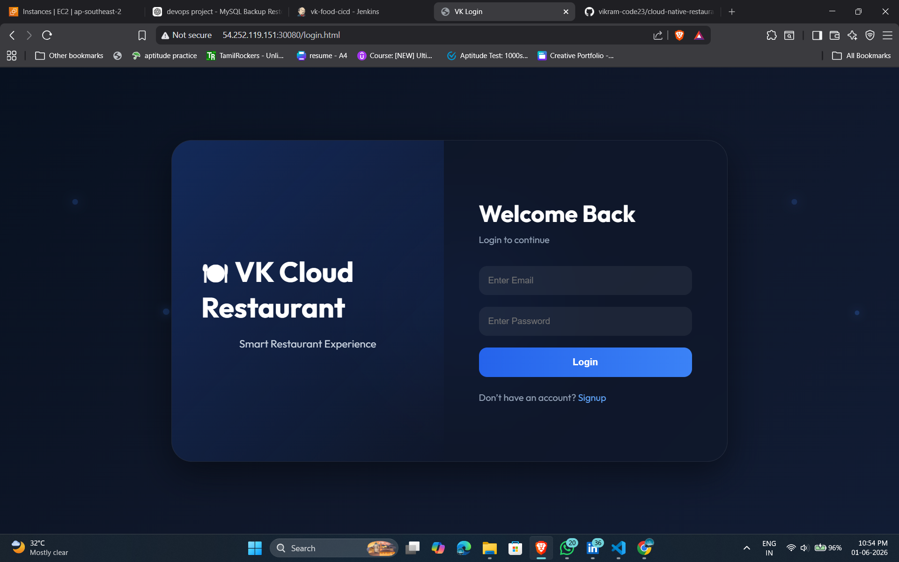
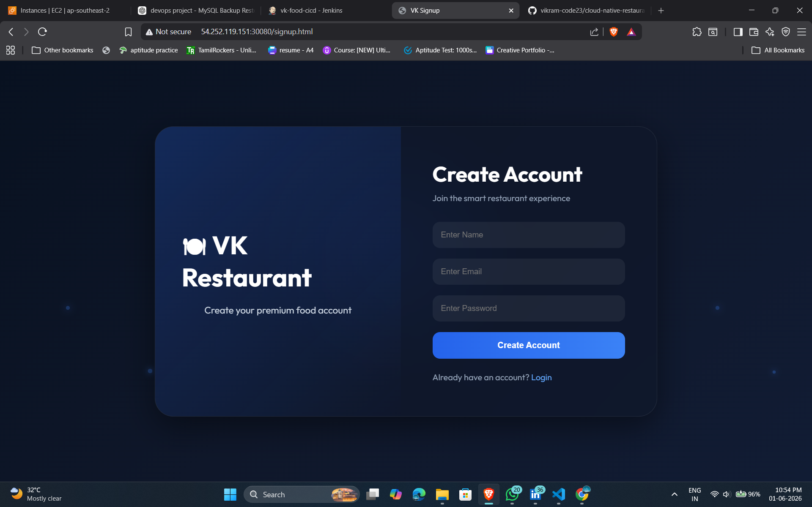
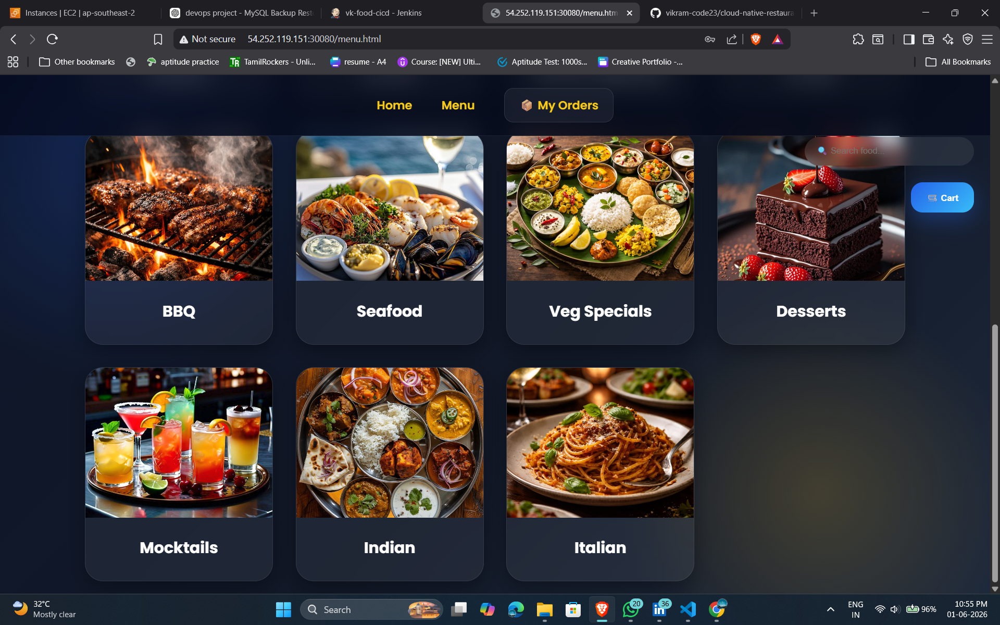
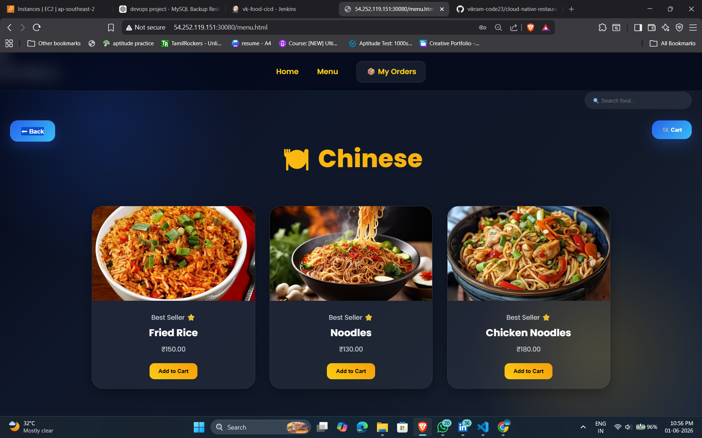
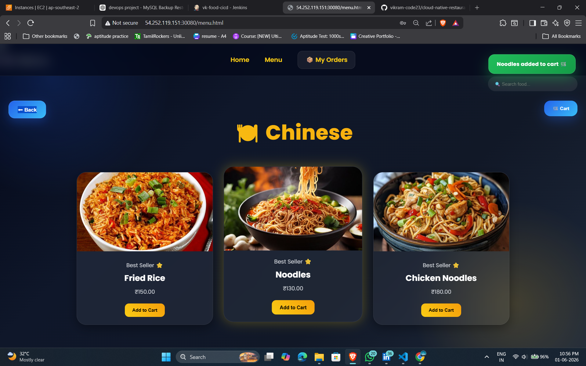
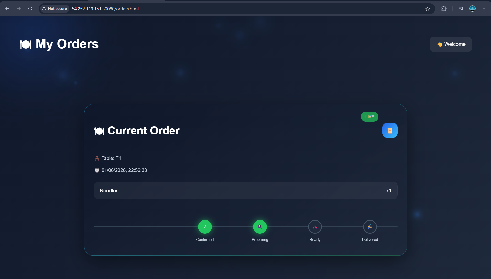

# Cloud Native Restaurant Platform

A full-stack cloud-native restaurant ordering system built using Node.js, MySQL, Docker, Jenkins, Kubernetes and AWS.

## Features

- Customer food ordering system
- Category based menu
- Food images
- Cart management
- Table selection
- Checkout system
- Live order tracking
- Admin dashboard
- Real-time order updates using Socket.IO
- Docker containerization
- Jenkins CI/CD pipeline
- Kubernetes deployment
- AWS EC2 hosting

## Architecture

Frontend
- HTML
- CSS
- JavaScript
- Nginx

Backend
- Node.js
- Express.js
- Socket.IO

Database
- MySQL 5.7

DevOps
- Docker
- Docker Compose
- Jenkins
- Kubernetes (Kind)
- AWS EC2

## Project Structure

```text
cloud-native-restaurant-platform
│
├── frontend/
├── backend/
├── k8s/
├── docker-compose.yml
├── Jenkinsfile
└── README.md
```

## Docker Deployment

```bash
docker-compose up --build -d
```

## Kubernetes Deployment

```bash
kubectl apply -f k8s/
```

## CI/CD Pipeline

1. GitHub Push
2. Jenkins Build Trigger
3. Docker Build
4. Docker Compose Deployment
5. Application Update

## Screenshots

## Screenshots

### Home Page


### Login Page


### Signup Page


### Menu Categories



### Menu Items



### Cart


### Order Placed


### Order Tracking


### Admin Dashboard


### Jenkins CI/CD


### Kubernetes Pods


### Docker Containers


## Future Enhancements

- Monitoring with Prometheus
- Grafana Dashboard
- Kubernetes Ingress
- SSL HTTPS
- AWS EKS Deployment
- Auto Scaling

## Author

Vikram VK